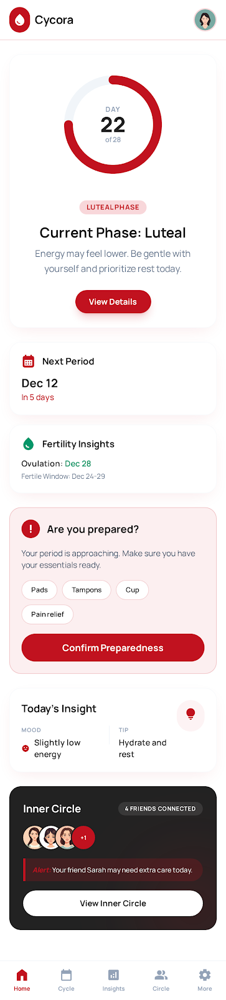
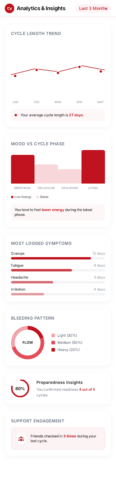
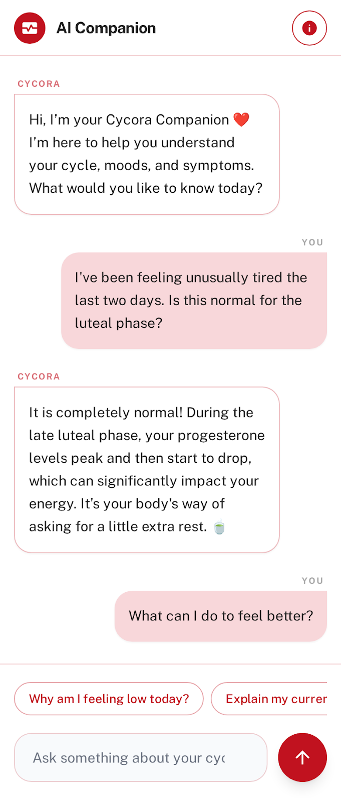

# CYCORA 🎯  
### *In Sync With You*

---

## Basic Details

### Team Name:
ethercore

### Team Members
- Minnah Pattar Kadavan – College of Engineering Attingal
- Kalyani R – College of Engineering Attingal

### Hosted Project Link
Frontend: [Add hosted link here]  
Backend API: [Add backend link here]

---

## Project Description

**Cycora** is a menstrual wellness and emotional support platform designed to help women track their cycle, predict upcoming phases, monitor symptoms and moods, and receive emotional support through a unique feature called *Inner Circle*.

It combines cycle tracking, AI-based predictions, emotional insights, and supportive friendships — all in a clean, elegant, privacy-focused experience.

---

## The Problem Statement

Menstrual health tracking apps focus mainly on physical cycle logging but overlook emotional well-being and social support.

Women often:
- Feel misunderstood during different cycle phases
- Lack emotional support from close friends
- Do not have personalized mood + symptom insights
- Worry about privacy when using health apps

There is a need for a safe, emotionally intelligent, and privacy-focused platform that connects cycle tracking with support.

---

## The Solution

Cycora solves this by:

- Providing accurate menstrual cycle prediction using user input
- Tracking moods, symptoms, and patterns
- Generating AI-powered insights
- Introducing **Inner Circle**, where up to 10 trusted friends can receive optional phase updates
- Encouraging empathy and emotional care
- Ensuring privacy-first architecture using secure authentication and database design

Cycora blends wellness, technology, and emotional intelligence.

---

# Technical Details

## Technologies/Components Used

### For Software:

**Languages Used:**
- Python
- JavaScript
- HTML
- CSS

**Frameworks Used:**
- Flask (Backend REST API)
- Firebase Authentication
- Firebase Firestore (Database)

**Libraries Used:**
- Flask-RESTful
- Firebase Admin SDK
- datetime (Python)
- CORS
- Fetch API (Frontend)

**Tools Used:**
- VS Code
- Git & GitHub
- Postman (API testing)
- Firebase Console

---

## Features

- 🔴 Secure User Authentication (Firebase Auth)
- 📅 Menstrual Cycle Tracking
- 📊 AI-based Next Cycle Prediction
- 😊 Mood & Symptom Logging
- 📈 Analytics & Insights Dashboard
- 👭 Inner Circle (Invite up to 10 trusted friends)
- 🔐 Privacy Controls for Sharing
- 🤖 AI Companion Chat
- 🎮 Gamification (Streaks & Achievements)
- 🌐 Community Section

---

# Implementation

## For Software:

### Installation

```bash
# Clone the repository
git clone https://github.com/your-username/cycora.git

# Navigate to backend
cd backend

# Create virtual environment
python -m venv venv

# Activate virtual environment
venv\Scripts\activate   # Windows
source venv/bin/activate   # Mac/Linux

# Install dependencies
pip install -r requirements.txt
System Architecture

Architecture Explanation:

Frontend (HTML/CSS/JS)
⬇
Flask REST API
⬇
Firebase Authentication (User Auth)
⬇
Firebase Firestore (User Data Storage)

Data Flow:

User logs data from frontend

Data sent via REST API

Flask processes prediction logic

Data stored in Firestore

Insights returned to frontend

Application Workflow

User signs up → Firebase Authentication

User inputs last period date + cycle length

Backend calculates:

Next period

Ovulation window

Phase predictions

User logs daily mood/symptoms

Analytics engine identifies patterns

Inner Circle shares optional phase updates

API Documentation
Base URL:

http://localhost:5000/api
POST /register
Registers a new user.

Request Body:

{
  "email": "user@example.com",
  "password": "123456"
}
Response:

{
  "status": "success",
  "message": "User registered successfully"
}
POST /cycle
Stores cycle information.

{
  "user_id": "abc123",
  "last_period_date": "2026-02-01",
  "cycle_length": 28
}
GET /prediction/<user_id>
Returns cycle predictions.

Response:

{
  "next_period": "2026-02-29",
  "ovulation_date": "2026-02-15",
  "phase": "Luteal"
}
POST /mood
Stores daily mood log.

{
  "user_id": "abc123",
  "date": "2026-02-20",
  "mood": "Low Energy",
  "symptoms": ["Cramps", "Headache"]
}
POST /inner-circle/invite
Invite friend to Inner Circle.

Project Demo
Video
[Add YouTube / Drive Link]

The video demonstrates:

User registration

Cycle prediction

Mood logging

Inner Circle notifications

AI companion interaction

AI Tools Used
Tool Used: ChatGPT
Purpose:

Backend architecture planning

Workflow structuring

Debugging assistance

Percentage of AI-generated code: ~30%

Human Contributions:

Full architecture design

Backend logic implementation

Database modeling

UI/UX design

Feature planning (Inner Circle concept)

Team Contributions
Minnah Pattar Kadavan: Backend development, API creation, database design, prediction logic

Kalyani R: Frontend UI/UX design, API integration, user experience flow

License
This project is licensed under the MIT License.

Made with ❤️ at TinkerHub
